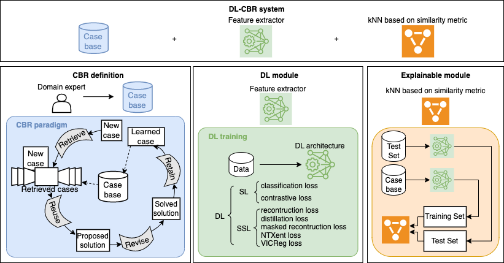

# **Oral3**

This GitHub repo for the design analysis of different Case-Based Reasoning (CBR) systems enhanced by Deep Learning (DL) to support oral cancer diagnosis.

Two main DL strategies have been adopted for DL module design to get a feature extractor to be integrated in DL-CBR system:
- Supervised Learning (SL)
- Self-supervised Learning (SSL)

Each of these strategies can rely on different loss function during the training. The following table present the SOTA architectures adopted in this project

| Model      | DL strategy | loss function |
|------------|-------------|---------------|
| ConvNext   | SL          | CrossEntropyLoss              |
| SqueezeNet | SL          | CrossEntropyLoss              |
| Vit_b      |  SL         | CrossEntropyLoss              |
| Swin S     |   SL        | CrossEntropyLoss              |
| TripletNet | SL          | ContrastiveLoss              |
| CAE | SSL          | MSELoss              |
| DINO      |  SSL         | DINOLoss              |
| MAE     |   SSL        | MSELoss              |
| MoCo     |   SSL        | NTXentLoss              |
| VICReg     |   SSL        | VICRegLoss              |

Additional information and instuction for the usage can be found in the [official documentation](docs/README.md)